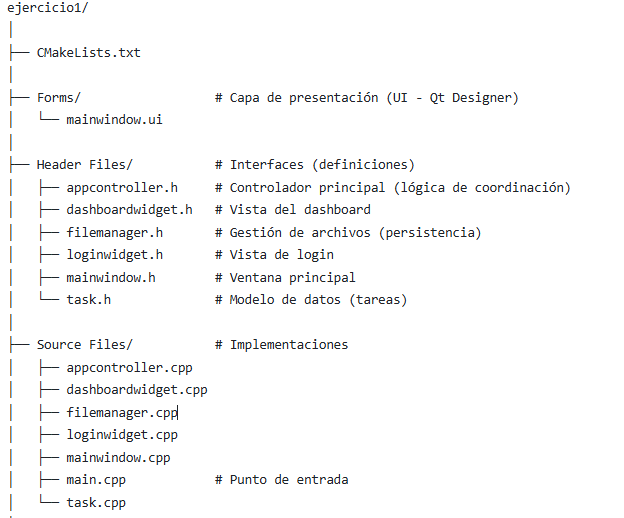
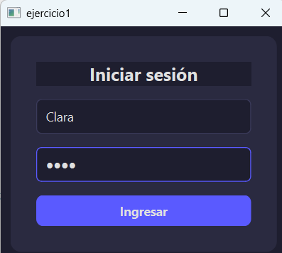
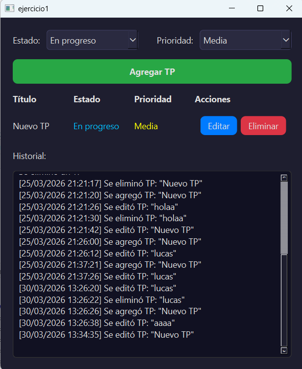
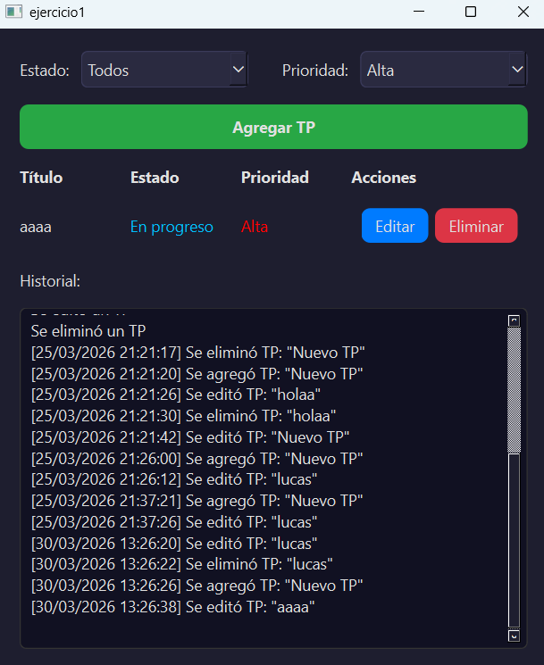

# 📌 Planificador de Trabajos Prácticos – Qt

## 🧾 Descripción

Aplicación de escritorio desarrollada en **Qt (Widgets)** para la gestión y planificación de trabajos prácticos. Permite a los usuarios autenticarse, organizar tareas, realizar seguimiento de entregas y mantener un historial de acciones, todo con persistencia local.

---

## 🎯 Objetivo

Desarrollar una aplicación funcional que implemente conceptos fundamentales de interfaces gráficas en Qt, manejo de archivos y organización modular del código.

---

## ⚙️ Funcionalidades

### 🔐 Autenticación

* Login con validación de usuarios.
* Usuarios almacenados en archivo local (CSV o JSON).
* Persistencia de sesión durante 5 minutos (simulación).
* Recordatorio de sesión en el mismo equipo.

### 📋 Gestión de Trabajos Prácticos

* Visualización en formato tablero usando `QGridLayout`.
* Cada fila contiene:

  * Información del trabajo (QLabel).
  * Botones de acción (editar, eliminar, etc.).
* Filtros por:

  * Estado (pendiente, en progreso, finalizado).
  * Prioridad.

### ✏️ Operaciones CRUD

* Alta de nuevos trabajos prácticos.
* Edición de trabajos existentes.
* Eliminación de trabajos.

### 📝 Notas

* Editor de notas asociado a cada trabajo.
* Guardado manual de contenido.

### 📚 Historial

* Registro de acciones realizadas por el usuario.
* Visualización en la interfaz.
* Persistencia en archivo local.

---

## 🧱 Estructura del Proyecto

---

## 🛠️ Tecnologías Utilizadas

* C++
* Qt (Widgets)
* Archivos locales 
---

## ▶️ Ejecución

1. Abrir el proyecto en Qt Creator.
2. Compilar en modo Debug o Release.
3. Ejecutar la aplicación.
4. Iniciar sesión con un usuario válido (definido en archivo local).

---

## 📌 Notas

* La persistencia de sesión es simulada (5 minutos).
* El sistema no utiliza bases de datos externas.
* Ideal para practicar arquitectura básica en aplicaciones Qt.
 ---
 
## 📷 Capturas Solicitadas
### Inicio Sesión

### Pantalla Principal

### Filtro por Estado

### Filtro por Prioridad

