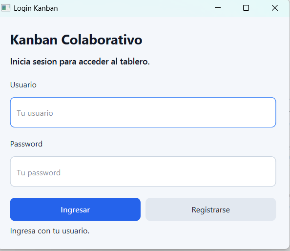
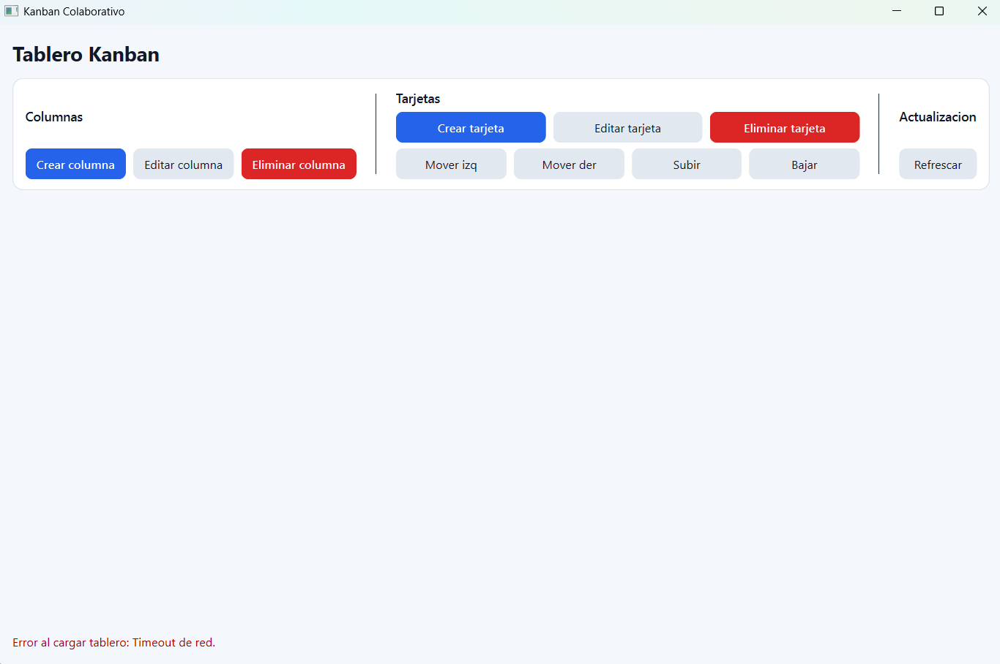

# 📑 Ejercicio 04 - Tablero Kanban colaborativo (Qt + API)

## Descripción 🖋️

Desarrollar una aplicación de escritorio en Qt que permita gestionar tareas tipo Kanban, usando el backend FastAPI del VPS y persistencia en MySQL.

Consolidar CRUD, orden y movimiento entre columnas.
Incorporar actualización colaborativa.

## Arquitectura del Programa 🏚️

El proyecto sigue una arquitectura cliente-servidor:

- **Cliente (Qt):** Aplicación de escritorio que proporciona la interfaz de usuario para gestionar el tablero Kanban. Se comunica con el backend a través de HTTP requests.
- **Servidor (FastAPI):** API REST que maneja la lógica de negocio, autenticación y operaciones CRUD. Desplegado en un VPS.
- **Base de Datos (MySQL):** Almacena las columnas, tarjetas y órdenes de manera persistente.

## Objetivos 🎯
- Implementar un tablero Kanban funcional en una aplicación de escritorio.
- Integrar frontend (Qt) con backend (FastAPI).
- Persistir datos en MySQL.
- Permitir trabajo colaborativo con actualización en tiempo real.
- Aplicar arquitectura cliente-servidor modular.

### Backend (FastAPI):
- CRUD de columnas y tarjetas.
- Endpoint para mover tarjeta entre columnas.
- Endpoint para reordenar tarjetas en una columna.
- Autenticación básica (reutilizar la del VPS).

### Base de datos (MySQL ℹ️):
- Tablas: columns, cards, card_order.

### App Qt:
- Vista Kanban con columnas y tarjetas.
- Crear/editar/eliminar tarjetas y columnas.
- Mover tarjetas (drag-and-drop o botones "mover").
- Actualización en tiempo real (polling cada 3-5s o WebSocket).

### Persistencia:
- Al reiniciar, el tablero queda igual.
### Imágenes 🖼️

#### Pantalla Login

#### Pantalla Tablero

Se puede observar que este no carga debido a una demora u error en el funcionamiento del servidor Contabo.

