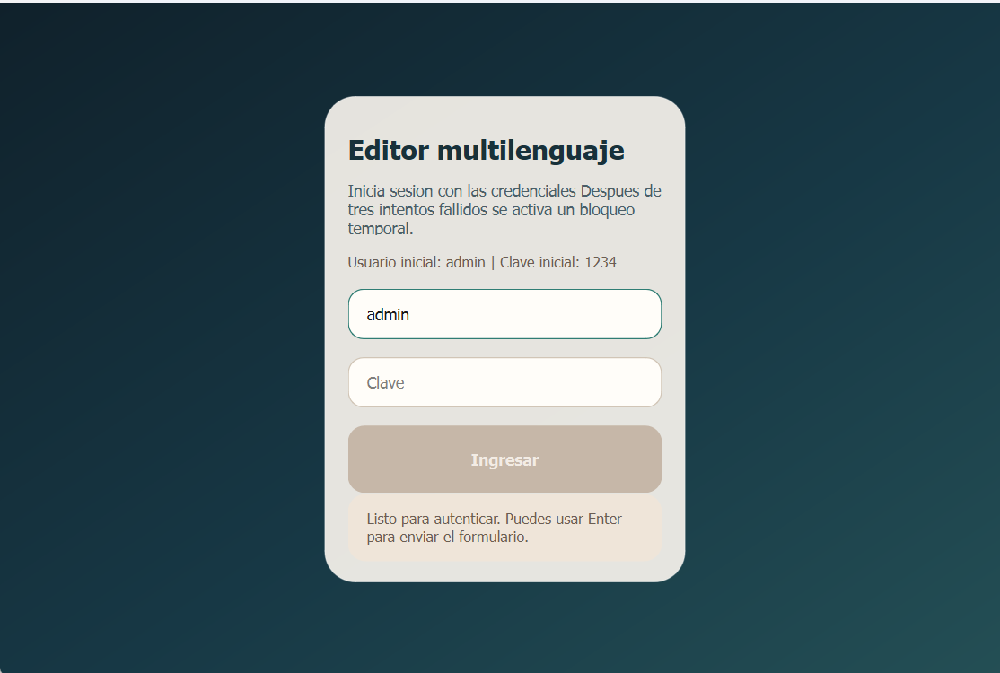
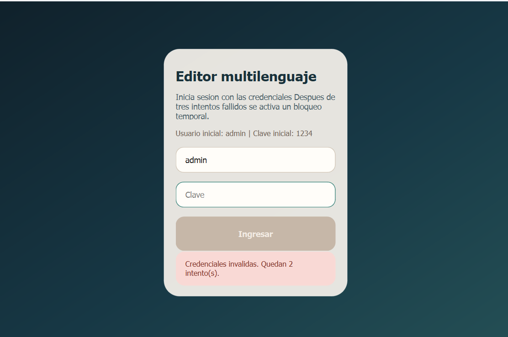
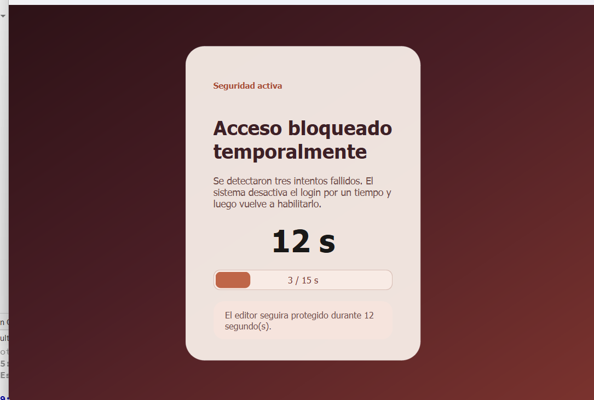
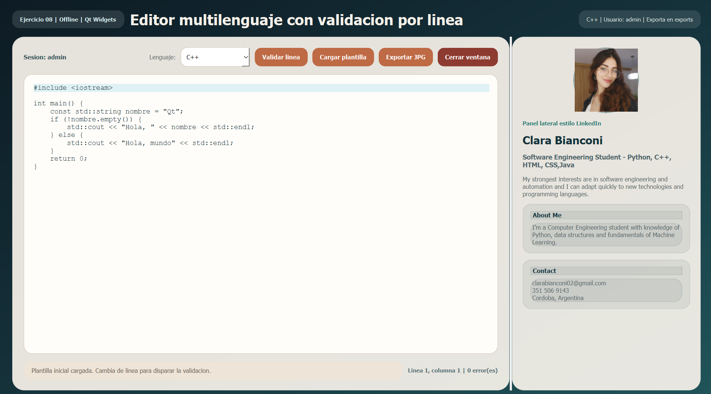
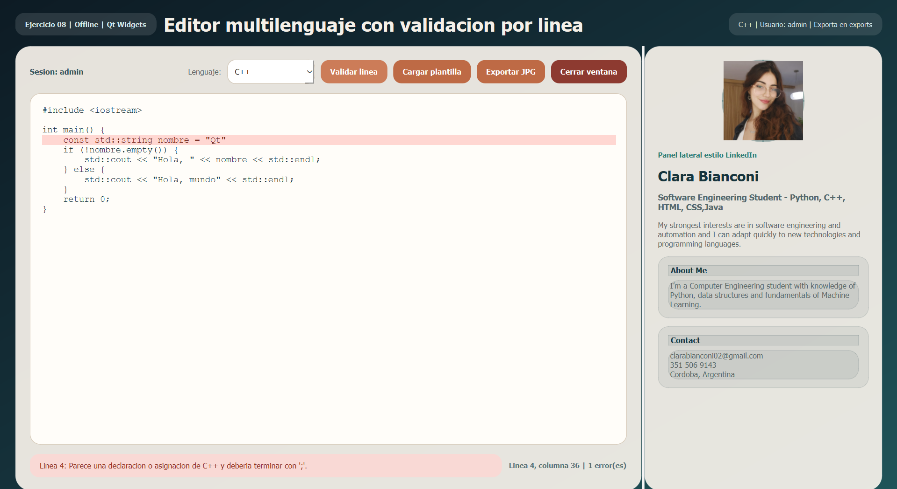

# Ejercicio 08 - Editor multilenguaje en Qt 💻

Resolución completa de la consigna en `ejercicio8/codigo`, siguiendo el enfoque visto en clase con:

- `Pantalla` abstracta y uso real de polimorfismo.
- Signals/slots para coordinar la interfaz.
- Validadores de sintaxis por jerarquía (`ValidadorSintaxis`, `ValidadorCpp`, `ValidadorPython`, `ValidadorJava`).
- Configuración leída desde archivo `INI`.
- Registro de eventos en archivo de log.
- Funcionamiento offline, sin servicios remotos.

## Ubicación del ejercicio 📌

Todo el código fuente del ejercicio está en:

- `codigo/`

## Credenciales iniciales 💁

Se leen desde `codigo/config/app.ini`.

Valores por defecto:

- Usuario: `admin`
- Clave: `1234`

## Requisitos de la consigna cubiertos ✔️

1. Login inicial con bloqueo temporal luego de 3 intentos fallidos.
2. Clase base abstracta `Pantalla` con métodos virtuales puros:
   `inicializarUI()`, `conectarEventos()`, `cargarDatos()`, `validarEstado()` y `registrarEvento()`.
3. Pantallas derivadas concretas:
   `LoginScreen`, `EditorPrincipal` y `ModoBloqueado`.
4. Flujo controlado por `AppController` usando punteros a la clase base `Pantalla`.
5. Selector de lenguaje con soporte para `C++`, `Python` y `Java`.
6. Resaltado de errores en rojo y mensaje diagnóstico amigable en UI.
7. Redefinición de eventos:
   `keyPressEvent`, `mousePressEvent`, `resizeEvent`, `closeEvent`, `focusInEvent` y `focusOutEvent`.
8. Registro de eventos relevantes en `codigo/logs/editor_multilenguaje.log`.
9. Lectura de configuración desde `codigo/config/app.ini`.
10. Funcionamiento offline.
11. Apertura de la ventana principal en full screen después del login válido.
12. Exportación a un único archivo JPG legible con todo el código y sus saltos de línea.
13. Panel lateral estilo LinkedIn con foto, descripción, habilidades y contacto.

## Estructura principal 🏠

```text
codigo/
|-- assets/profile/professional-profile.jpeg
|-- config/app.ini
|-- resources/resources.qrc
|-- editor_multilenguaje.pro
`-- src/
    |-- appconfig.*
    |-- appcontroller.*
    |-- editorprincipal.*
    |-- loginscreen.*
    |-- logger.*
    |-- modobloqueado.*
    |-- models.h
    |-- pantalla.*
    `-- validadorsintaxis.*
```

## Cómo compilar ⏯️

El proyecto está preparado con `qmake` (`.pro`) y Qt Widgets.

Ejemplo general:

```bash
cd codigo
qmake editor_multilenguaje.pro
make
```

También se puede abrir directamente `codigo/editor_multilenguaje.pro` desde Qt Creator.


## Comportamiento del editor 🖋️

- La validación corre cuando se abandona la línea actual.
- Cada error queda resaltado en rojo.
- El diagnóstico aparece debajo del editor.
- La exportación genera un solo JPG dentro de la carpeta configurada.
## Validación con compilador: 
Solo se validará la línea solo al presionar su respectivo botón.
  ### C++:
  Si hay un compilador C++ disponible (como g++ o clang++), intenta compilar el código completo en un archivo temporal usando flags de sintaxis (-fsyntax-only). Analiza los errores del compilador para reportar problemas más precisos. Si no encuentra un compilador o falla, vuelve a la validación heurística, es decir, a la básica. Por ejemplo: corchetes, punto y coma, el #include, etc.
  ### Java:
  Solo hace la validación básica.
  #### Python:
  Solo hace validación básica.
   

## Imagenes 🖼️

### Login


 
### Login Cuando se Ingresa Clave Incorrecta



### Pantalla de Bloqueo



### Pantalla Principal



### Pantalla Principal Cuando Validador Encuentra Error

